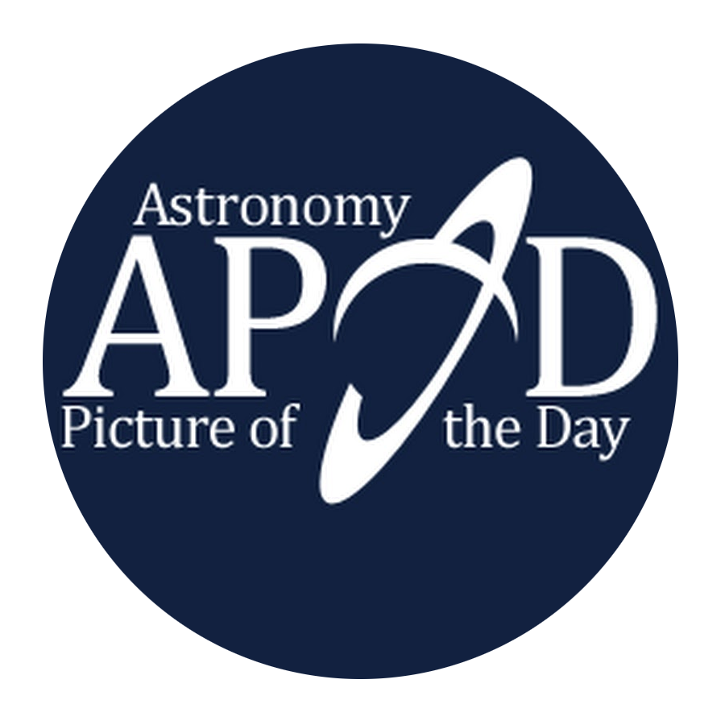

<!-- PROJECT LOGO -->
<br />
<div align="center">
  <a href="https://github.com/dev-igorcarvalho/POC-Flutter_CleanArch_APOD">
    
  </a>

<h3 align="center">NASA Astornomy Picture Of Day - CleanArch POC</h3>

  <p align="center">
    A flutter proof of concept app made with flutter and Clean Architetcure
</div>


<!-- TABLE OF CONTENTS -->
<details open="open">
  <summary>Table of Contents</summary>
  <ol>
    <li>
      <a href="#about-the-project">About The Project</a>
      <ul>
        <li><a href="#built-with">Built With</a></li>
      </ul>
    </li>
    <li>
      <a href="#getting-started">Getting Started</a>
      <ul>
        <li><a href="#prerequisites">Prerequisites</a></li>
        <li><a href="#installation">Installation</a></li>
      </ul>
    </li>
    <li><a href="#usage">Usage</a></li>
    <li><a href="#contributing">Contributing</a></li>
    <li><a href="#license">License</a></li>
    <li><a href="#contact">Contact</a></li>
    <li><a href="#acknowledgements">Acknowledgements</a></li>
  </ol>
</details>


<!-- ABOUT THE PROJECT -->
## About The Project
A flutter proof of concept app, designed by clean architecture principles, 
to access NASA APOD API , retrieve and show a list of astronomy pictures.


### Built With

This section should list any major frameworks that you built your project using. Leave any add-ons/plugins for the acknowledgements section. Here are a few examples.
* [Flutter](https://flutter.dev/)
* [Get It](https://pub.dev/packages/get_it)
* [Bloc](https://pub.dev/packages/get_it)


<!-- GETTING STARTED -->
## Getting Started

### Prerequisites

* Flutter SDK
* Android Studio or VsCode

### Installation

1. Get a free API Key at [https://api.nasa.gov](https://api.nasa.gov)
2. Clone the repo
   ```sh
   git clone https://github.com/dev-igorcarvalho/POC-Flutter_CleanArch_APOD
   ```
3. Install PUD DEV packages
   ```sh
   flutter pub get
   ```
4. Create generated files
   ```sh
   flutter pub run build_runner build
   ```
5. Enter your API config in `/lib/main_development.dart`
   ```DART
   Config(Api('https://api.nasa.gov/planetary/apod',
      'Your api key'));
   ```

6. Run the tests
   ```DART
   flutter test
   ```
   
7. Start `/lib/main_development.dart` at your mobile emulator of choice 

<!-- USAGE EXAMPLES -->
## Usage

The app has :

- two screens: a list of the images and a detail screen
- The images list display the title, date and provide a search field in the top (find by title)
- The detail screen  have the image and the texts: date, title and explanation
- Work offline (each api call caches the result locally)

<!-- CONTRIBUTING -->
## Contributing

Contributions are what make the open source community such an amazing place to be learn, inspire, and create. Any contributions you make are **greatly appreciated**.

1. Fork the Project
2. Create your Feature Branch (`git checkout -b feature/AmazingFeature`)
3. Commit your Changes (`git commit -m 'Add some AmazingFeature'`)
4. Push to the Branch (`git push origin feature/AmazingFeature`)
5. Open a Pull Request


<!-- LICENSE -->
## License

Distributed under the MIT License. See `LICENSE` for more information.


<!-- CONTACT -->
## Contact

Igor Carvalho - [Linkedin](https://www.linkedin.com/in/igor-carvalho-se/?locale=en_US) - dev.igorcarvalho@gmail.com

Project Link: [POC-Flutter_CleanArch_APOD](https://github.com/dev-igorcarvalho/POC-Flutter_CleanArch_APOD)


<!-- ACKNOWLEDGEMENTS -->
## Acknowledgements
* [NASA Astronomy Picture Of Day](https://apod.nasa.gov)


